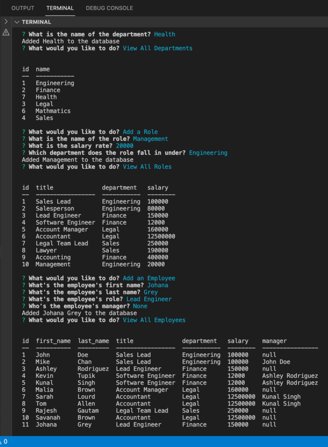

# Employee Tracker

### Description
This is a node.js command line application which takes the prompt inputs to add, update, modified, and view the employee records and stored them in the MySql database. 

## Built with:

- [MySQL2 package](https://www.npmjs.com/package/mysql2)

- [Node.js](https://developer.mozilla.org/en-US/docs/Glossary/Node.js?retiredLocale=hu)

- [Inquirer Packages](https://www.npmjs.com/package/inquirer)

- [console.table package](https://www.npmjs.com/package/console.table)

## Feature List:
- Node.js - Used for package managment and to execute JavaScript code to build command line.

- MySql - Used to store all the added, updated, and modified data through prompts within the application.

The application will be invoked by typing the command:
node server.js

## Walkthrough video:

## Screenshots
 

  

  

  

## Links :

* Link for the Github repository [Host by Github](https://github.com/Rajesh295-dev/Employee_Tracker)

## Contributor:

* [Rajesh Gautam](https://github.com/Rajesh295-dev)

- - -
 

